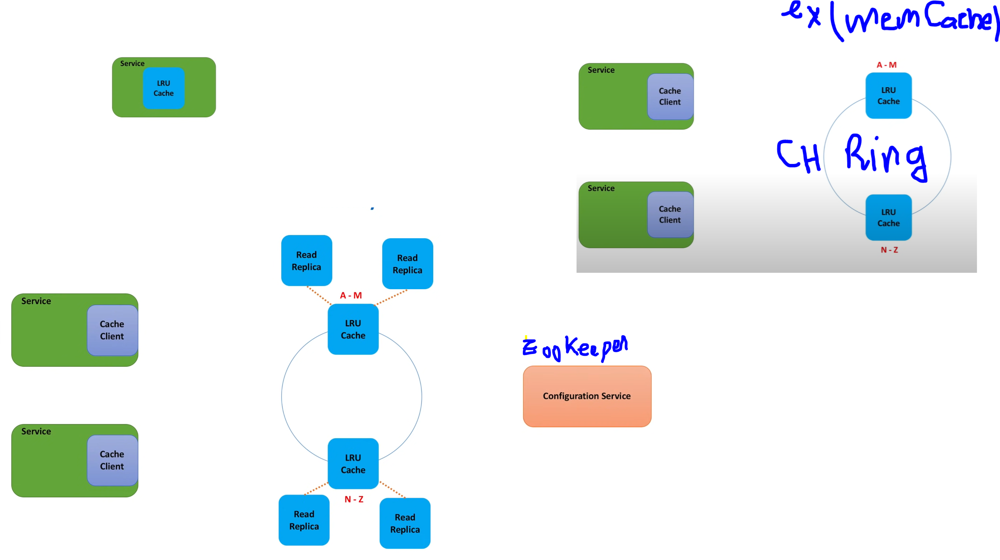

# Caching

We can start with a single host and implement a Least Recently Used cache (LRU cache) in-memory. We can use Hashtable + Doubly linked list data structure.
Local cache has a limited memory capacity and does not scale, fot that we my run the LRU cache as a standalone process and we use a cache client to writes data to the specific shard that stores data for each key. Memcahed is build on top of these principles.

To improve **Availability** and read scalability, we can introduce **master-slave** data replication. For monitoring leaders and read replicas and provide **failover** support, we add a configuration service (like ZooKeeper), which is used by cache clients for discovering cache servers.

## Cache clients

Cache client (CC) use either TCP or UDP to call the cache process using one of the folowing mechanism.

* A MOD fuction based on the item key and some hash function. this solution fail if we add another cache host!
* Consistent hashing based on mapping each object to a point on a circle

